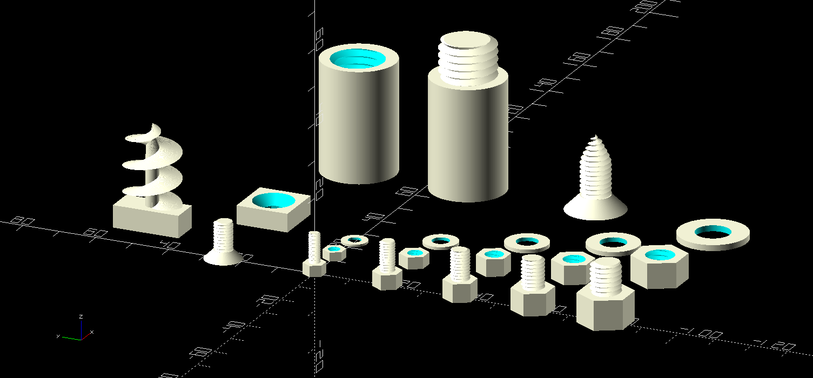

# OpenSCAD threads.scad module

<p align="center"></p>

This is an efficient OpenSCAD threading library intended primarily to be used
as a component in other designs.  It supports metric compatible internal and
external threads, auger threads, thread tapering, clearance holes, countersunk
holes, recessed holes, hex bolts, nuts, washers, Phillips tips, and long rods
which are extended with threaded joints.  Whenever possible this complies with
metric standards for the defaults of parameters, while providing overrides for
many values.

The core threading routine makes use of list comprehensions to generate the
entire threaded screw as a single polyhedron.  This substantially improves the
rendering speed and robustness over other approaches, decreases the number of
facets necessary, and increases the tactile smoothness of the resulting parts.
This also allows partially tapered screw ends, plus auger and
conventional threads which come to a point.

# threads.scad API

Where parameters are shown with a default of 0 or -1, in many cases this indicates a standard default value will be calculated internally if this is not overridden.

```
// This creates a vertical rod at the origin with external threads.  It uses
// metric standards by default.
module ScrewThread(outer_diam, height, pitch=0, tooth_angle=30, tolerance=0.4, tip_height=0, tooth_height=0, tip_min_fract=0)

// This creates a vertical rod at the origin with external auger-style
// threads.
module AugerThread(outer_diam, inner_diam, height, pitch, tooth_angle=30, tolerance=0.4, tip_height=0, tip_min_fract=0)

// This creates a threaded hole in its children using metric standards by
// default.
module ScrewHole(outer_diam, height, position=[0,0,0], rotation=[0,0,0], pitch=0, tooth_angle=30, tolerance=0.4, tooth_height=0)

// This creates an auger-style threaded hole in its children.
module AugerHole(outer_diam, inner_diam, height, pitch, position=[0,0,0], rotation=[0,0,0], tooth_angle=30, tolerance=0.4)

// This inserts a ClearanceHole in its children.
// The rotation vector is applied first, then the position translation,
// starting from a position upward from the z-axis at z=0.
module ClearanceHole(diameter, height, position=[0,0,0], rotation=[0,0,0], tolerance=0.4)

// This inserts a ClearanceHole with a recessed bolt hole in its children.
// The rotation vector is applied first, then the position translation,
// starting from a position upward from the z-axis at z=0.  The default
// recessed parameters fit a standard metric bolt.
module RecessedClearanceHole(diameter, height, position=[0,0,0], rotation=[0,0,0], recessed_diam=-1, recessed_height=-1, tolerance=0.4)

// This inserts a countersunk ClearanceHole in its children.
// The rotation vector is applied first, then the position translation,
// starting from a position upward from the z-axis at z=0.
// The countersunk side is on the bottom by default.
module CountersunkClearanceHole(diameter, height, position=[0,0,0], rotation=[0,0,0], sinkdiam=0, sinkangle=45, tolerance=0.4)

// This inserts a Phillips tip shaped hole into its children.
// The rotation vector is applied first, then the position translation,
// starting from a position upward from the z-axis at z=0.
module PhillipsTip(width=7, thickness=0, straightdepth=0, position=[0,0,0], rotation=[0,0,0])

// Create a standard sized metric bolt with hex head and hex key.
module MetricBolt(diameter, length, tolerance=0.4)

// Create a standard sized metric countersunk (flat) bolt with hex key drive.
// In compliance with convention, the length for this includes the head.
module MetricCountersunkBolt(diameter, length, tolerance=0.4)

// Create a standard sized metric countersunk (flat) bolt with hex key drive.
// In compliance with convention, the length for this includes the head.
module MetricWoodScrew(diameter, length, tolerance=0.4)

// Create a standard sized metric hex nut.
module MetricNut(diameter, thickness=0, tolerance=0.4)

// Create a convenient washer size for a metric nominal thread diameter.
module MetricWasher(diameter)

// Solid rod on the bottom, external threads on the top.
module RodStart(diameter, height, thread_len=0, thread_diam=0, thread_pitch=0)

// Solid rod on the bottom, internal threads on the top.
// Flips around x-axis after printing to pair with RodStart.
module RodEnd(diameter, height, thread_len=0, thread_diam=0, thread_pitch=0)

// Internal threads on the bottom, external threads on the top.
module RodExtender(diameter, height, thread_len=0, thread_diam=0, thread_pitch=0)

// Produces a matching set of metric bolts, nuts, and washers.
module MetricBoltSet(diameter, length, quantity=1)

// This generates a closed polyhedron from an array of arrays of points,
// with each inner array tracing out one loop outlining the polyhedron.
// pointarrays should contain an array of N arrays each of size P outlining a
// closed manifold.  The points must obey the right-hand rule.  For example,
// looking down, the P points in the inner arrays are counter-clockwise in a
// loop, while the N point arrays increase in height.  Points in each inner
// array do not need to be equal height, but they usually should not meet or
// cross the line segments from the adjacent points in the other arrays.
// (N>=2, P>=3)
// Core triangles:
//   [j][i], [j+1][i], [j+1][(i+1)%P]
//   [j][i], [j+1][(i+1)%P], [j][(i+1)%P]
//   Then triangles are formed in a loop with the middle point of the first
//   and last array.
module ClosePoints(pointarrays)
```

The following functions also provide standard metric values for a given
diameter:  ThreadPitch, HexAcrossFlats, HexAcrossCorners, HexDriveAcrossFlats,
HexDriveAcrossCorners, CountersunkDriveAcrossFlats,
CountersunkDriveAcrossCorners, NutThickness.

# Usage Notes for 3D printing

Good use of this library requires a printer which is properly calibrated for
extrusion width, and which is producing consistent stable parts.  In early
tests, threaded holes (internal threads) of size M2 and higher worked fine with
standard metal bolts.  M3 bolts (external threads) worked under good
conditions, but would be disrupted by small changes in print quality.  M4 and
higher were quite reliable.

The extendable rod functions were added to support printing vertical rods
taller than the available printer height.  Early tests show this works very
well and can be quite sturdy with appropriate infill.  With appropriate plastic
and settings this could probably be used to create fairly long rods.

